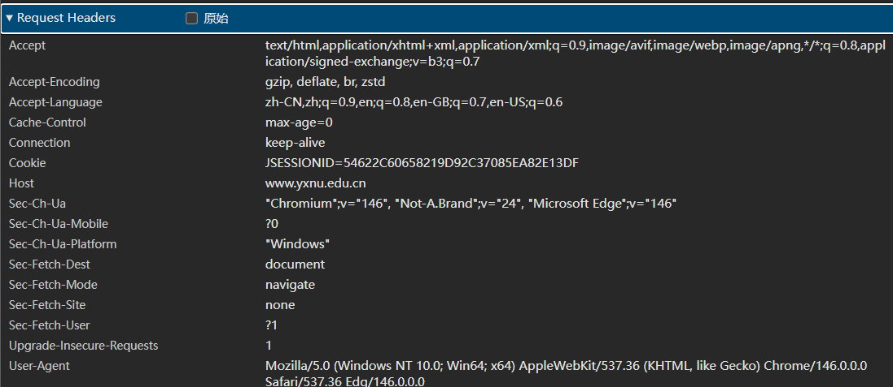
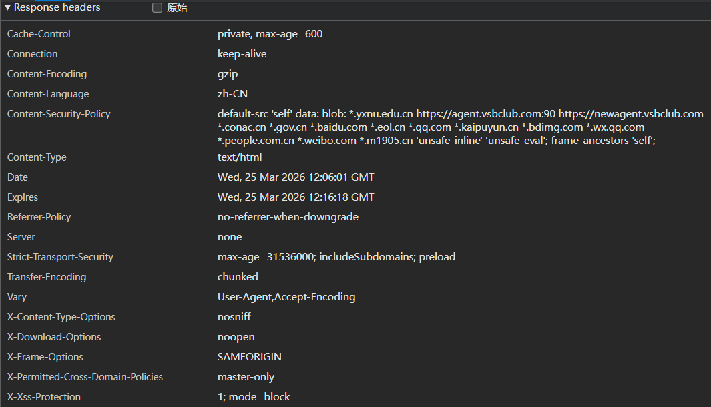

# Lab1：又见面了， HTTP/HTTPS！

## 实验背景

HTTP（HyperText Transfer Protocol，超文本传输协议）是应用层最核心的协议之一。每次打开网页，浏览器与服务器之间就在用 HTTP"对话"。

一次典型的 HTTP 交互分为两部分：

```
浏览器 ──── HTTP 请求 ────▶ 服务器
浏览器 ◀─── HTTP 响应 ──── 服务器
```

**请求报文**结构示例：

```http
GET /index.html HTTP/1.1
Host: www.example.com
User-Agent: Mozilla/5.0
Accept: text/html
```

**响应报文**结构示例：

```http
HTTP/1.1 200 OK
Content-Type: text/html
Content-Length: 1234

<html>...</html>
```

HTTPS 在 HTTP 基础上加入了 TLS 加密，报文内容在传输过程中无法被直接读取。但**浏览器开发者工具**运行在加密之前，可以看到完整的明文请求和响应，是分析 HTTP/HTTPS 协议最方便的入门工具。

---

## 实验任务

1. 用 Chrome 或 Edge 浏览器访问任意 **HTTPS** 站点，例如 `https://www.yxnu.edu.cn/`。
2. 按 `F12`（macOS 用 `Command + Option + I`）打开**开发者工具**，切换到 **Network（网络）** 面板。
3. 刷新页面，等待请求列表加载完成。
4. 点击列表中第一条请求（通常是页面本身），在右侧查看 **Headers** 标签页，找到 Request Headers 和 Response Headers。
5. 对请求头区域和响应头区域分别**截图**，并按规范命名（见下方截图要求）。
6. 根据截图，完成下方的知识填空。

> **提示**：开发者工具打开路径：浏览器右上角菜单 → 更多工具 → 开发者工具，或直接右键页面空白处 → 检查。

---

## 截图要求

- 截图须清晰显示开发者工具 Network 面板中的 **Headers** 区域，能看到具体字段名和值。
- 截图文件与本 `http.md` 放在**同一目录**下。
- 命名规范：

| 截图内容                       | 文件名                                 |
| :----------------------------- | :------------------------------------- |
| Request Headers（请求头）截图  | `req.png`    ( jpg 或 jpeg 格式也可以) |
| Response Headers（响应头）截图 | `resp.png`  ( jpg或 jpeg 格式也可以)   |

截图示例位置（填写时直接在下方嵌入）：

```markdown


```

---

## 知识填空

> 根据你的截图，填写以下空白处。不确定的字段请写"截图中未见"，**不得留空不填**。

### A. 请求头（Request Headers）

| 字段               | 你的截图中的值 |
| :----------------- | :------------- |
| 请求方法（Method） | GET               |
| 请求路径（URI）    |  /            |
| 协议版本           | HTTP/1.1                 |
| Host               | www.yxnu.edu.cn               |
| User-Agent         | Mozilla/5.0 (Windows NT 10.0; Win64; x64) AppleWebKit/537.36 (KHTML, like Gecko) Chrome/146.0.0.0 Safari/537.36 Edg/146.0.0.0               |

**嵌入截图：**


---

### B. 响应头（Response Headers）

| 字段                  | 你的截图中的值 |
| :-------------------- | :------------- |
| 状态码（Status Code） | 200               |
| 状态描述              | OK               |
| Content-Type          |text/html                |
| Server（若可见）      | 截图中未见               |

**嵌入截图：**


---

### C. 知识问答

1. HTTP 请求报文由哪几部分构成？请按顺序列出：

   > 答：请求行、请求头、空行、请求体（GET 方法通常无请求体）。

2. 状态码 `404` 代表什么含义？状态码 `500` 和 `503` 有什么区别？

   > 答：
1、404：服务器无法找到请求的资源，即所访问的页面或文件不存在。
2、500：服务器内部发生未知错误，通常由代码异常、逻辑错误或配置问题导致。
3、503：服务器暂时无法处理请求，多因过载、维护或资源不足，属于临时状态，通常会在恢复后自动解决。

3. GET 与 POST 方法的主要区别是什么？各适用于什么场景？

   > 答：
1.核心区别
数据传输位置不同：GET 方法将参数附加在 URL 地址后发送，数据在地址栏可见；POST 方法将参数封装在请求体（Request Body）中发送，地址栏不可见。
数据长度限制不同：GET 传输的数据量受 URL 长度限制（通常约 2KB~8KB）；POST 理论上无长度限制，可传输大量数据。
安全性与缓存不同：GET 因数据暴露在 URL 中，安全性较低，结果可被浏览器主动缓存；POST 数据相对隐蔽，通常不会被缓存，适合传输敏感或大量数据。
2.适用场景
GET 方法：适用于获取 / 查询数据，不产生服务器端副作用的场景。例如：浏览网页、搜索关键词查询、获取静态资源（图片 / 文件）等。
POST 方法：适用于提交 / 创建数据，会对服务器状态产生改变的场景。例如：用户登录、注册账号、提交表单、上传文件、支付订单等。


4. HTTP 与 HTTPS 有什么区别？HTTPS 使用了什么机制来保护数据？

   > 答：
   1、HTTP 与 HTTPS 的主要区别
   a、传输安全性不同：HTTP 以明文形式传输数据，内容容易被窃听、篡改和伪造；HTTPS 对传输内容进行加密处理，数据不易被窃取和篡改，安全性更高。
   b、默认端口不同：HTTP 默认使用 80 端口 通信，HTTPS 默认使用 443 端口 通信。
   c、连接方式不同：HTTP 是基于 TCP 的简单应用层协议；HTTPS 是在 HTTP 与 TCP 之间加入了 TLS/SSL 加密层，本质是HTTP + TLS/SSL。
   d、证书要求不同：HTTPS 需要服务器安装由权威机构颁发的数字证书，用于身份验证；HTTP 不需要证书。
   e、缓存与性能不同：HTTP 开销更小、速度更快；HTTPS 因加密解密操作，性能开销略大。
   2、HTTPS 保护数据的机制
   a、非对称加密：用于安全交换对称加密的密钥，保证密钥在传输过程中不被泄露。
   b、对称加密：密钥协商完成后，使用对称加密对实际传输的 HTTP 数据进行加密，保证传输内容机密性。
   c、数字签名与消息认证：对数据进行校验，防止内容被篡改，同时验证服务器身份，避免访问伪造的恶意站点。

5. 既然 HTTPS 已经加密，为什么浏览器开发者工具仍然能看到请求和响应的明文内容？

   > 答：因为HTTPS只对浏览器与服务器之间网络传输过程中的数据进行加密，而浏览器开发者工具是浏览器的内置功能，工作在加密之前和解密之后，所以发送请求时能抓到尚未加密的明文，接收响应时能抓到已经解密完成的明文，因此可以直接查看完整的请求和响应内容。

---

## 提交要求

在自己的文件夹下新建 `Lab1/` 目录，提交以下文件：

```
学号姓名/
└── Lab1/
    ├── http.md     # 本文件（填写完整）
    ├── req.png       # HTTP 请求截图 (除 png 外，使用 jpg 或者 jpeg 格式也可以)
    └── resp.png      # HTTP 响应截图 (除 png 外，使用 jpg 或者 jpeg 格式也可以) 
```

---

## 截止时间

2026-3-26，届时关于 Lab1 的 PR 请求将不会被合并。

---

## 参考资料

- [HTTP - MDN Web Docs](https://developer.mozilla.org/zh-CN/docs/Web/HTTP)
- [HTTP 状态码列表 - MDN](https://developer.mozilla.org/zh-CN/docs/Web/HTTP/Status)
