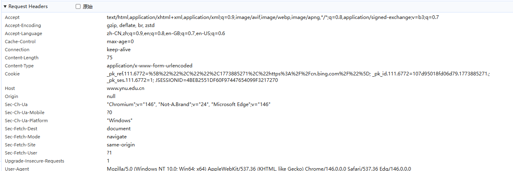
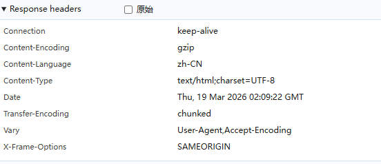

# Lab1：又见面了， HTTP/HTTPS！

## 实验背景

HTTP（HyperText Transfer Protocol，超文本传输协议）是应用层最核心的协议之一。每次打开网页，浏览器与服务器之间就在用 HTTP"对话"。

一次典型的 HTTP 交互分为两部分：

```
浏览器 ──── HTTP 请求 ────▶ 服务器
浏览器 ◀─── HTTP 响应 ──── 服务器
```

**请求报文**结构示例：

```http
GET /index.html HTTP/1.1
Host: www.example.com
User-Agent: Mozilla/5.0
Accept: text/html
```

**响应报文**结构示例：

```http
HTTP/1.1 200 OK
Content-Type: text/html
Content-Length: 1234

<html>...</html>
```

HTTPS 在 HTTP 基础上加入了 TLS 加密，报文内容在传输过程中无法被直接读取。但**浏览器开发者工具**运行在加密之前，可以看到完整的明文请求和响应，是分析 HTTP/HTTPS 协议最方便的入门工具。

---

## 实验任务

1. 用 Chrome 或 Edge 浏览器访问任意 **HTTPS** 站点，例如 `https://www.yxnu.edu.cn/`。
2. 按 `F12`（macOS 用 `Command + Option + I`）打开**开发者工具**，切换到 **Network（网络）** 面板。
3. 刷新页面，等待请求列表加载完成。
4. 点击列表中第一条请求（通常是页面本身），在右侧查看 **Headers** 标签页，找到 Request Headers 和 Response Headers。
5. 对请求头区域和响应头区域分别**截图**，并按规范命名（见下方截图要求）。
6. 根据截图，完成下方的知识填空。

> **提示**：开发者工具打开路径：浏览器右上角菜单 → 更多工具 → 开发者工具，或直接右键页面空白处 → 检查。

---

## 截图要求

- 截图须清晰显示开发者工具 Network 面板中的 **Headers** 区域，能看到具体字段名和值。
- 截图文件与本 `http.md` 放在**同一目录**下。
- 命名规范：

| 截图内容                       | 文件名                                 |
| :----------------------------- | :------------------------------------- |
| Request Headers（请求头）截图  | `req.png`    ( jpg 或 jpeg 格式也可以) |
| Response Headers（响应头）截图 | `resp.png`  ( jpg或 jpeg 格式也可以)   |

截图示例位置（填写时直接在下方嵌入）：

```markdown


```

---

## 知识填空

> 根据你的截图，填写以下空白处。不确定的字段请写"截图中未见"，**不得留空不填**。

### A. 请求头（Request Headers）

| 字段               | 你的截图中的值 |
| :----------------- | :------------- |
| 请求方法（Method） |       post         |
| 请求路径（URI）    |        /ssjggyy.jsp?wbtreeid=100011        |
| 协议版本           |     	HTTP/1.1（行业通用默认版本）           |
| Host               |     www.ynu.edu.cn           |
| User-Agent         |   Mozilla/5.0 (Windows NT 10.0; Win64; x64) AppleWebKit/537.36 (KHTML, like Gecko) Chrome/146.0.0.0 Safari/537.36 Edg/146.0.0.0             |

**嵌入截图：**


---

### B. 响应头（Response Headers）

| 字段                  | 你的截图中的值 |
| :-------------------- | :------------- |
| 状态码（Status Code） |          200      |
| 状态描述              |    ok            |
| Content-Type          |   text/html;charset=UTF-8             |
| Server（若可见）      |          截图中未见      |

**嵌入截图：**


---

### C. 知识问答

1. HTTP 请求报文由哪几部分构成？请按顺序列出：

   > 答：请求行：包含请求方法、请求 URI、协议版本
请求头：由多个描述客户端信息、请求参数的键值对组成
空行：用于分隔请求头与请求体
请求体：承载 POST 等方法提交的数据（GET 方法通常无请求体）


2. 状态码 `404` 代表什么含义？状态码 `500` 和 `503` 有什么区别？

   > 答：404 Not Found：服务器无法找到请求的资源，通常是 URL 错误或资源已被删除。
500 Internal Server Error：服务器在处理请求时发生了未知错误，属于服务器端代码 / 配置异常。
503 Service Unavailable：服务器暂时无法处理请求，通常是过载、维护或资源不足。
区别：500 是 “服务器出错了”，503 是 “服务器暂时不可用”，前者多为代码问题，后者多为负载或运维问题。

3. GET 与 POST 方法的主要区别是什么？各适用于什么场景？

   > 答：主要区别：
参数位置：GET 参数附在 URL 后可见，POST 参数放在请求体中不可见。
数据长度：GET 受 URL 长度限制，POST 理论上无长度限制。
安全性：GET 参数会被浏览器记录，安全性低；POST 参数不直接暴露，相对更安全。
缓存性：GET 可被浏览器缓存，POST 一般不缓存。
语义：GET 用于获取资源，POST 用于提交或修改资源。
适用场景：
GET：适合查询、浏览类操作，比如搜索、查看页面。
POST：适合提交表单、上传文件、修改数据等敏感或大数据量操作

4. HTTP 与 HTTPS 有什么区别？HTTPS 使用了什么机制来保护数据？

   > 答：区别：
HTTP 是明文传输，数据易被窃听、篡改；HTTPS 是加密传输，更安全
HTTPS 默认使用 443 端口，HTTP 使用 80 端口
HTTPS 需要 CA 证书认证服务器身份
保护机制：
HTTPS 基于 TLS/SSL 协议，通过以下机制保护数据：
对称加密：加密传输的实际数据，保证机密性
非对称加密：安全交换对称密钥，防止密钥泄露
数字签名：验证数据完整性，防止被篡改
数字证书：验证服务器身份，防止中间人攻击


5. 既然 HTTPS 已经加密，为什么浏览器开发者工具仍然能看到请求和响应的明文内容？

   > 答：HTTPS 加密是客户端与服务器之间的传输加密，保护的是网络传输过程中的数据。浏览器开发者工具是客户端本地工具，它在数据被 TLS 加密前（发送时）和被 TLS 解密后（接收时）捕获内容，因此能看到明文。本质上，HTTPS 是防止第三方窃听传输中的数据，并非阻止客户端自身查看数据。


---

## 提交要求

在自己的文件夹下新建 `Lab1/` 目录，提交以下文件：

```
学号姓名/
└── Lab1/
    ├── http.md     # 本文件（填写完整）
    ├── req.png       # HTTP 请求截图 (除 png 外，使用 jpg 或者 jpeg 格式也可以)
    └── resp.png      # HTTP 响应截图 (除 png 外，使用 jpg 或者 jpeg 格式也可以) 
```

---

## 截止时间

2026-3-26，届时关于 Lab1 的 PR 请求将不会被合并。

---

## 参考资料

- [HTTP - MDN Web Docs](https://developer.mozilla.org/zh-CN/docs/Web/HTTP)
- [HTTP 状态码列表 - MDN](https://developer.mozilla.org/zh-CN/docs/Web/HTTP/Status)

