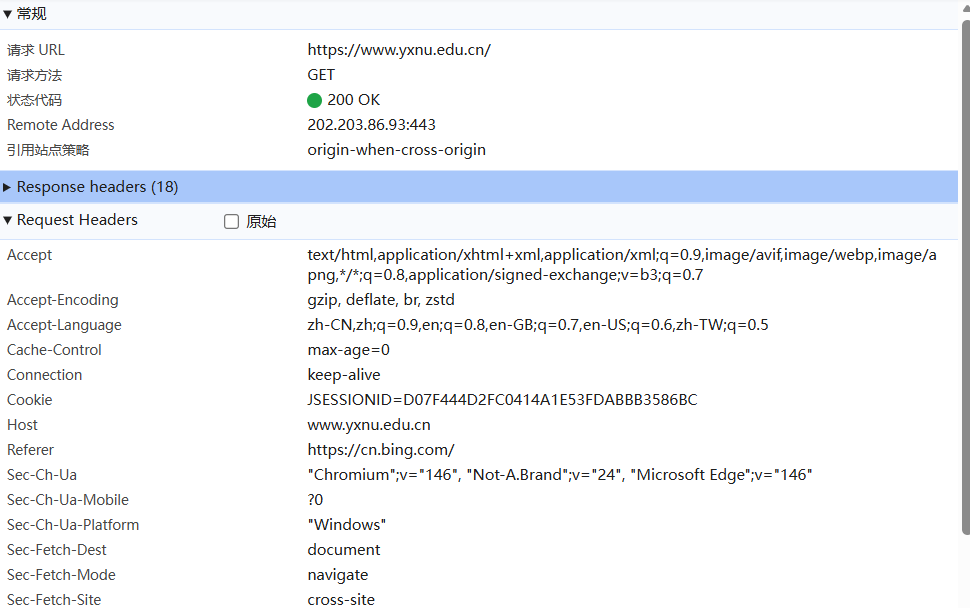
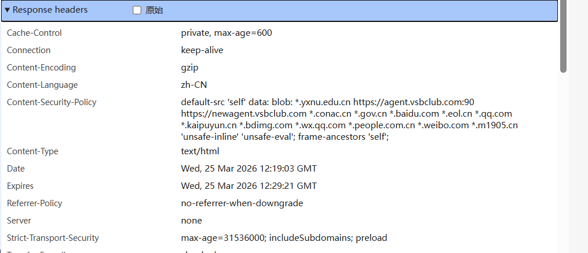

# Lab1：又见面了， HTTP/HTTPS！

## 实验背景

HTTP（HyperText Transfer Protocol，超文本传输协议）是应用层最核心的协议之一。每次打开网页，浏览器与服务器之间就在用 HTTP"对话"。

一次典型的 HTTP 交互分为两部分：

```
浏览器 ──── HTTP 请求 ────▶ 服务器
浏览器 ◀─── HTTP 响应 ──── 服务器
```

**请求报文**结构示例：

```http
GET /index.html HTTP/1.1
Host: www.example.com
User-Agent: Mozilla/5.0
Accept: text/html
```

**响应报文**结构示例：

```http
HTTP/1.1 200 OK
Content-Type: text/html
Content-Length: 1234

<html>...</html>
```

HTTPS 在 HTTP 基础上加入了 TLS 加密，报文内容在传输过程中无法被直接读取。但**浏览器开发者工具**运行在加密之前，可以看到完整的明文请求和响应，是分析 HTTP/HTTPS 协议最方便的入门工具。

---

## 实验任务

1. 用 Chrome 或 Edge 浏览器访问任意 **HTTPS** 站点，例如 `https://www.yxnu.edu.cn/`。
2. 按 `F12`（macOS 用 `Command + Option + I`）打开**开发者工具**，切换到 **Network（网络）** 面板。
3. 刷新页面，等待请求列表加载完成。
4. 点击列表中第一条请求（通常是页面本身），在右侧查看 **Headers** 标签页，找到 Request Headers 和 Response Headers。
5. 对请求头区域和响应头区域分别**截图**，并按规范命名（见下方截图要求）。
6. 根据截图，完成下方的知识填空。

> **提示**：开发者工具打开路径：浏览器右上角菜单 → 更多工具 → 开发者工具，或直接右键页面空白处 → 检查。

---

## 截图要求

- 截图须清晰显示开发者工具 Network 面板中的 **Headers** 区域，能看到具体字段名和值。
- 截图文件与本 `http.md` 放在**同一目录**下。
- 命名规范：

| 截图内容                       | 文件名                                 |
| :----------------------------- | :------------------------------------- |
| Request Headers（请求头）截图  | `req.png`    ( jpg 或 jpeg 格式也可以) |
| Response Headers（响应头）截图 | `resp.png`  ( jpg或 jpeg 格式也可以)   |

截图示例位置（填写时直接在下方嵌入）：

```markdown


```

---

## 知识填空

> 根据你的截图，填写以下空白处。不确定的字段请写"截图中未见"，**不得留空不填**。

### A. 请求头（Request Headers）

| 字段               | 你的截图中的值 |
| :----------------- | :------------- |
| 请求方法（Method） |    GET            |
| 请求路径（URI）    |    https://www.yxnu.edu.cn/              |
| 协议版本           |      （HTTP/1.1 隐式）          |
| Host               |     www.yxnu.edu.cn           |
| User-Agent         |       "Chromium";v="146", "Not-A.Brand";v="24", "Microsoft Edge";v="146"         |

**嵌入截图：**


---

### B. 响应头（Re   https://www.yxnu.edu.cn/sponse Headers）

| 字段                  | 你的截图中的值 |
| :-------------------- | :------------- |
| 状态码（Status Code） |      200          |
| 状态描述              |        OK        |
| Content-Type          |        text/html        |
| Server（若可见）      |    none            |

**嵌入截图：**


---

### C. 知识问答

1. HTTP 请求报文由哪几部分构成？请按顺序列出：

   > 答： HTTP 请求报文由四部分按顺序构成：
请求行（Request Line）：包含请求方法、请求 URL、协议版本。
请求头（Request Headers）：一系列键值对，描述客户端信息、请求内容类型等。
空行（CRLF）：分隔请求头与请求体，必不可少。
请求体（Request Body）：携带请求的数据，可选，如 POST 的表单内容。

2. 状态码 `404` 代表什么含义？状态码 `500` 和 `503` 有什么区别？

   > 答：404：未找到。服务器无法找到请求的资源，URL 错误或资源已被删除。
500 vs 503 区别：
500 内部服务器错误：服务器处理请求时遇到未知、意外的错误，如代码异常、配置错误。
503 服务不可用：服务器当前无法提供服务，通常是由于过载、维护或暂时停机，未来可能恢复。

3. GET 与 POST 方法的主要区别是什么？各适用于什么场景？

   > 答：主要区别：
参数位置：GET 参数拼在 URL 中；POST 参数放在请求体里。
数据长度：GET 受 URL 长度限制；POST 理论上无限制。
安全性：GET 参数可见，安全性低；POST 参数不可见，更安全。
缓存：GET 可被浏览器缓存；POST 通常不缓存。
适用场景：
GET：用于获取、查询数据，如浏览网页、搜索、查看文章。
POST：用于提交、创建数据，如登录注册、上传文件、提交表单。

4. HTTP 与 HTTPS 有什么区别？HTTPS 使用了什么机制来保护数据？

   > 答：核心区别：HTTP 是超文本传输协议，明文传输，无加密；HTTPS 是安全的超文本传输协议，基于 TLS/SSL 加密，数据传输安全。
加密机制：HTTPS 采用对称加密与非对称加密结合的机制。
服务器持有非对称密钥对（公钥、私钥）。
客户端用服务器的公钥加密 “随机密钥” 并发送给服务器。
服务器用私钥解密得到 “随机密钥”。
后续通信双方均使用这个随机密钥进行对称加密，兼顾安全性与效率。

5. 既然 HTTPS 已经加密，为什么浏览器开发者工具仍然能看到请求和响应的明文内容？

   > 答： 开发者工具看到的明文，是浏览器已经解密后的数据。

---

## 提交要求

在自己的文件夹下新建 `Lab1/` 目录，提交以下文件：

```
学号姓名/
└── Lab1/
    ├── http.md     # 本文件（填写完整）
    ├── req.png       # HTTP 请求截图 (除 png 外，使用 jpg 或者 jpeg 格式也可以)
    └── resp.png      # HTTP 响应截图 (除 png 外，使用 jpg 或者 jpeg 格式也可以) 
```

---

## 截止时间

2026-3-26，届时关于 Lab1 的 PR 请求将不会被合并。

---

## 参考资料

- [HTTP - MDN Web Docs](https://developer.mozilla.org/zh-CN/docs/Web/HTTP)
- [HTTP 状态码列表 - MDN](https://developer.mozilla.org/zh-CN/docs/Web/HTTP/Status)

