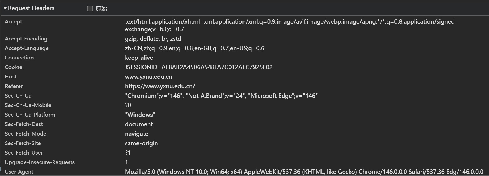
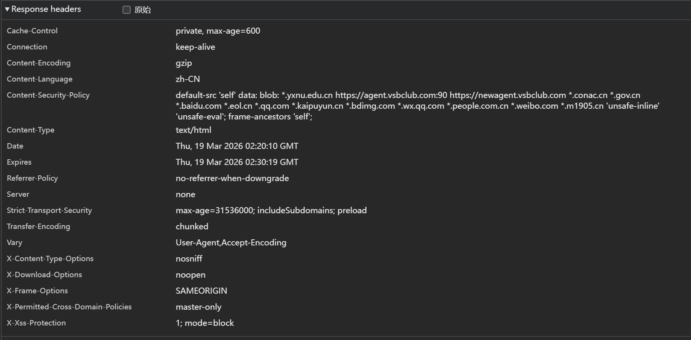

# Lab1：又见面了， HTTP/HTTPS！

## 实验背景

HTTP（HyperText Transfer Protocol，超文本传输协议）是应用层最核心的协议之一。每次打开网页，浏览器与服务器之间就在用 HTTP"对话"。

一次典型的 HTTP 交互分为两部分：

```
浏览器 ──── HTTP 请求 ────▶ 服务器
浏览器 ◀─── HTTP 响应 ──── 服务器
```

**请求报文**结构示例：

```http
GET /index.html HTTP/1.1
Host: www.example.com
User-Agent: Mozilla/5.0
Accept: text/html
```

**响应报文**结构示例：

```http
HTTP/1.1 200 OK
Content-Type: text/html
Content-Length: 1234

<html>...</html>
```

HTTPS 在 HTTP 基础上加入了 TLS 加密，报文内容在传输过程中无法被直接读取。但**浏览器开发者工具**运行在加密之前，可以看到完整的明文请求和响应，是分析 HTTP/HTTPS 协议最方便的入门工具。

---

## 实验任务

1. 用 Chrome 或 Edge 浏览器访问任意 **HTTPS** 站点，例如 `https://www.yxnu.edu.cn/`。
2. 按 `F12`（macOS 用 `Command + Option + I`）打开**开发者工具**，切换到 **Network（网络）** 面板。
3. 刷新页面，等待请求列表加载完成。
4. 点击列表中第一条请求（通常是页面本身），在右侧查看 **Headers** 标签页，找到 Request Headers 和 Response Headers。
5. 对请求头区域和响应头区域分别**截图**，并按规范命名（见下方截图要求）。
6. 根据截图，完成下方的知识填空。

> **提示**：开发者工具打开路径：浏览器右上角菜单 → 更多工具 → 开发者工具，或直接右键页面空白处 → 检查。

---

## 截图要求

- 截图须清晰显示开发者工具 Network 面板中的 **Headers** 区域，能看到具体字段名和值。
- 截图文件与本 `http.md` 放在**同一目录**下。
- 命名规范：

| 截图内容                       | 文件名                                 |
| :----------------------------- | :------------------------------------- |
| Request Headers（请求头）截图  | `req.png`    ( jpg 或 jpeg 格式也可以) |
| Response Headers（响应头）截图 | `resp.png`  ( jpg或 jpeg 格式也可以)   |

截图示例位置（填写时直接在下方嵌入）：

```markdown


```

---

## 知识填空

> 根据你的截图，填写以下空白处。不确定的字段请写"截图中未见"，**不得留空不填**。

### A. 请求头（Request Headers）

| 字段               | 你的截图中的值 |
| :----------------- | :------------- |
| 请求方法（Method） |GET|
| 请求路径（URI）    |https://www.yxnu.edu.cn/index.htm|
| 协议版本           |HTTP/1.1|
| Host               |www.yxnu.edu|
| User-Agent         |Mozilla/5.0 (Windows NT 10.0; Win64; x64) AppleWebKit/537.36 (KHTML, like Gecko) Chrome/146.0.0.0 Safari/537.36 Edg/146.0.0.0|

**嵌入截图：**



---

### B. 响应头（Response Headers）

| 字段                  | 你的截图中的值 |
| :-------------------- | :------------- |
| 状态码（Status Code） |200|
| 状态描述              |OK|
| Content-Type          |text/html|
| Server（若可见）      |none|

**嵌入截图：**



---

### C. 知识问答

1. HTTP 请求报文由哪几部分构成？请按顺序列出：

   > 答：(1)请求行：请求方法、请求 URL、HTTP 版本;(2)请求头：以键值对形式描述客户端信息、请求参数等（如 Host: www.example.com、User-Agent: ...）；(3)空行：分隔请求头和请求体，标志请求头结束；（4）请求体：承载 POST 等方法提交的数据，GET 方法通常无请求体。

2. 状态码 `404` 代表什么含义？状态码 `500` 和 `503` 有什么区别？

   > 答：（1）404 Not Found：服务器无法找到请求的资源，通常是 URL 错误、资源已删除或不存在。（2）500 Internal Server Error：服务器内部处理请求时发生未知错误（如代码异常、逻辑错误）。（3）503 Service Unavailable：服务器暂时无法处理请求（如过载、维护中、资源不足），通常是临时状态，可重试。

3. GET 与 POST 方法的主要区别是什么？各适用于什么场景？

   > 答：主要区别：
   （1）参数位置：GET 的参数会拼接在 URL 中，直接可见；POST 的参数则放在请求体里，不会直接暴露在地址栏。
   （2）数据长度：GET 受 URL 长度限制（通常约 2KB-8KB），能传递的数据量小；POST 理论上没有长度限制，适合传输大量数据。
   （3）安全性：GET 参数会出现在 URL、历史记录和服务器日志里，安全性较低；POST 参数在请求体中，相对更安全。
   （4）缓存与幂等：GET 请求默认会被浏览器和代理服务器缓存，且是幂等的（多次请求结果一致）；POST 默认不缓存，也不具备幂等性（多次提交可能产生重复数据）。
   （5）历史记录：GET 请求会被浏览器保存为历史记录，可回退；POST 不会被保存到历史记录中。
   适用场景：
   GET：适合用于查询、获取资源的场景，比如搜索关键词、查看文章列表、获取用户信息等，这类操作不会对服务器数据产生修改或副作用。
   POST：适合用于提交、修改资源的场景，比如用户登录、注册账号、上传文件、提交表单数据等，这类操作会对服务器数据产生新增或修改的副作用。


4. HTTP 与 HTTPS 有什么区别？HTTPS 使用了什么机制来保护数据？

   > 答：HTTP与HTTPS的主要区别：
   （1）安全性：HTTP 是明文传输，数据易被窃听、篡改；HTTPS 是加密传输，数据更安全。
   （2）端口：HTTP 默认端口 80，HTTPS 默认端口 443。
   （3）证书：HTTPS 需要 CA 颁发的 SSL/TLS 证书，验证服务器身份；HTTP 无需证书。
   （4）性能：HTTPS 因加密 / 解密流程，性能略低于 HTTP。
   HTTPS的保护机制（HTTPS 基于 SSL/TLS 协议，通过以下机制保护数据）：
   （1）加密传输：使用对称加密（如 AES）加密传输数据，非对称加密（如 RSA）交换对称密钥。
   （2）身份验证：通过数字证书验证服务器身份，防止中间人攻击。
   （3）完整性校验：使用消息摘要算法（如 SHA-256）校验数据完整性，防止数据被篡改。


5. 既然 HTTPS 已经加密，为什么浏览器开发者工具仍然能看到请求和响应的明文内容？

   > 答：HTTPS 加密是端到端（客户端 ↔ 服务器）的加密，而浏览器开发者工具是客户端内部的工具，处于加密链路的 “客户端端点”：
   （1）浏览器先与服务器完成 TLS 握手，建立加密通道。（2）数据在网络传输时是加密的，但到达浏览器后会被解密为明文，供页面渲染和开发者工具查看。（3）开发者工具看到的是浏览器解密后的本地数据，并非网络传输中的加密数据，因此能看到完整的请求 / 响应明文。

---

## 提交要求

在自己的文件夹下新建 `Lab1/` 目录，提交以下文件：

```
学号姓名/
└── Lab1/
    ├── http.md     # 本文件（填写完整）
    ├── req.png       # HTTP 请求截图 (除 png 外，使用 jpg 或者 jpeg 格式也可以)
    └── resp.png      # HTTP 响应截图 (除 png 外，使用 jpg 或者 jpeg 格式也可以) 
```

---

## 截止时间

2026-3-26，届时关于 Lab1 的 PR 请求将不会被合并。

---

## 参考资料

- [HTTP - MDN Web Docs](https://developer.mozilla.org/zh-CN/docs/Web/HTTP)
- [HTTP 状态码列表 - MDN](https://developer.mozilla.org/zh-CN/docs/Web/HTTP/Status)

